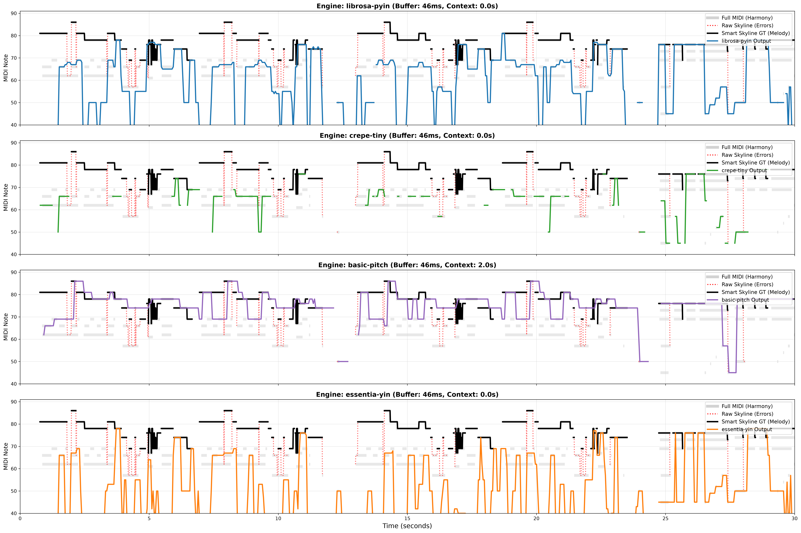
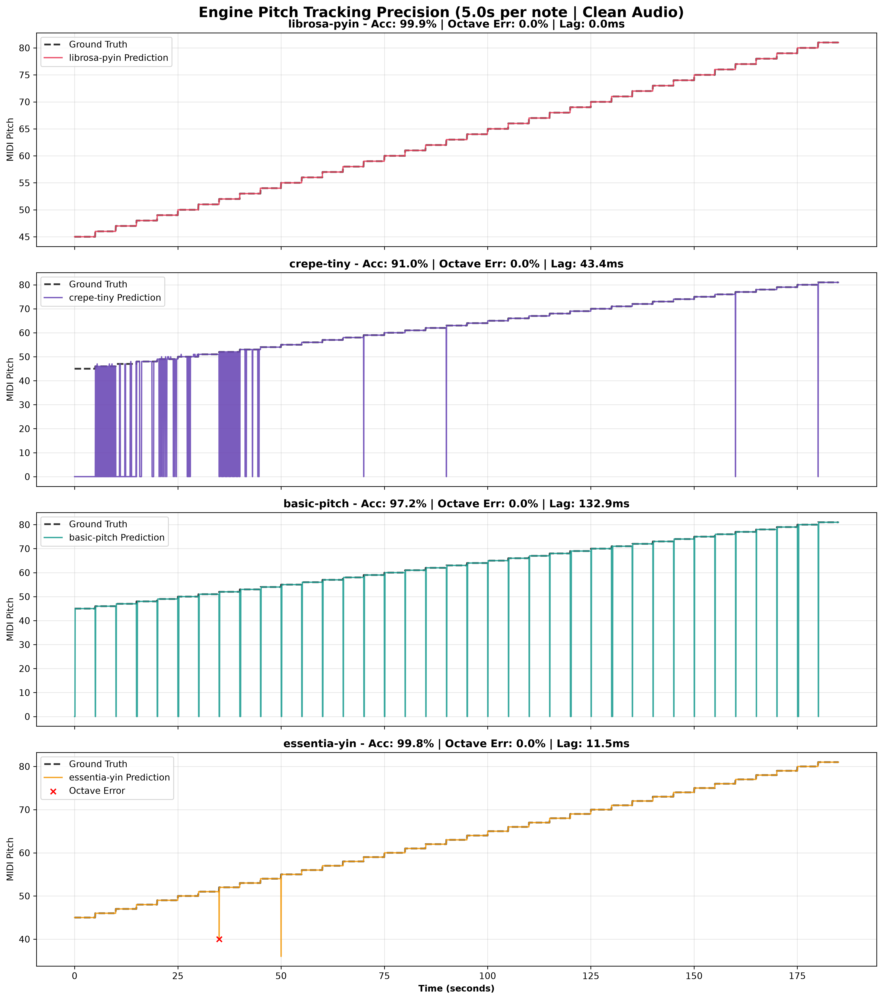
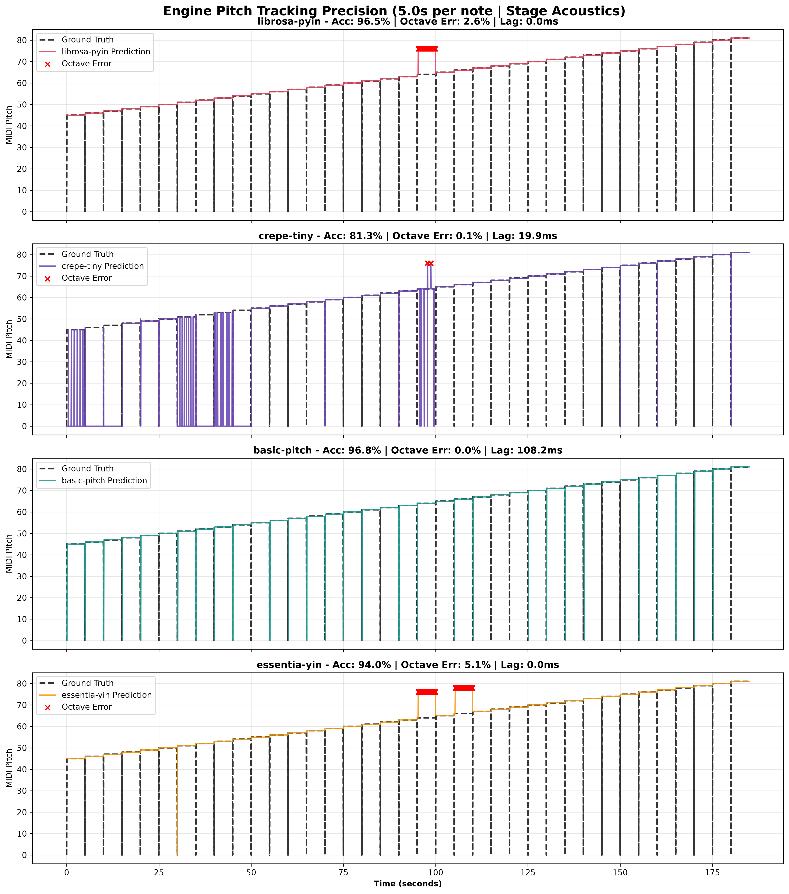
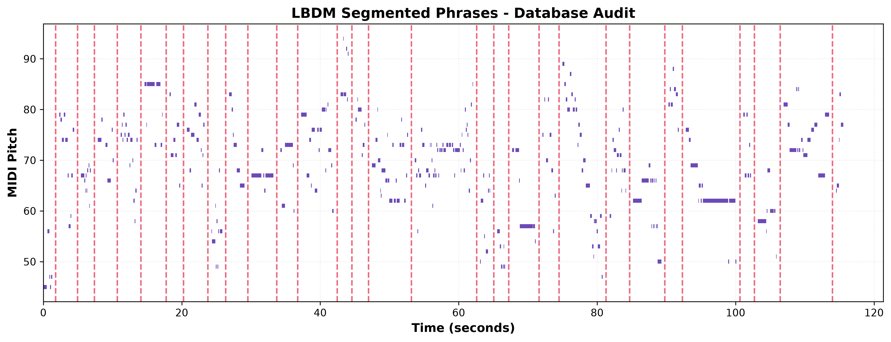
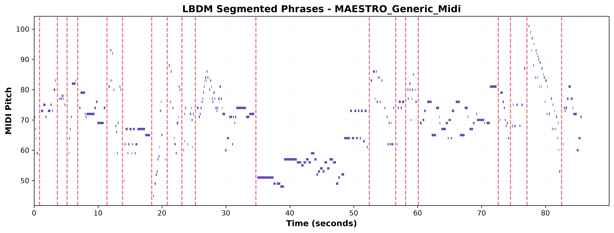

# Melodict

**Real-time symbolic melody extraction, phrase segmentation, and dictionary generation for interactive music systems.**

## Overview

**Melodict** bridges the gap between raw audio capture (via Max/MSP or live instruments like piano and guitar) and symbolic AI generation. Designed to overcome traditional FFT filtering delays and legacy pitch-tracking bottlenecks, Melodict provides an ultra-low-latency Open Sound Control (OSC) pipeline that:

1. **Extracts** symbolic pitch and MIDI events in real-time using State-of-the-Art (SOTA) neural networks and acoustic trackers.
2. **Segments** continuous melodic streams into natural musical phrases using Gestalt-based heuristic models (LBDM).
3. **Builds** structured phrase dictionaries on the fly, enabling reactive AI accompaniment.

### Phase 1: Real-Time Melody Extraction Breakthroughs
During our initial evaluation phase on the MAESTRO (Piano) and GuitarSet datasets, we implemented two critical architectural improvements:
* **Smart Skyline Ground Truth:** We enhanced the traditional Skyline algorithm with offline contextual windowing to detect and filter out "bass bleeding" during melodic rests, providing a mathematically pure Ground Truth for evaluations.
* **Asymmetric Sliding Window:** To solve the latency vs. context dilemma, we wrapped Convolutional Neural Networks (like Spotify's `basic-pitch`) in a historical circular buffer. The audio advances in ultra-fast 46 ms increments, allowing the CNN to utilize deep polyphonic context while delivering zero-perceived-latency updates to the musician.

*Figure 1: Frame-level visualization (46ms buffer) comparing SOTA engines against the MAESTRO dataset. The Smart Skyline (Solid Black) successfully ignores the bass-bleeding errors (Dotted Red) that pollute traditional extraction. The 2.0s buffered basic-pitch (Purple) successfully tracks the true melody through polyphonic noise where acoustic algorithms fail.*

**Key Findings (Empirical Benchmarks):**
* **Latency:** Acoustic trackers like `essentia-yin` process 46ms frames in just **3.5 ms**. Neural Networks require the circular buffer architecture to function in live environments.
* **Complex Polyphony (Piano):** The CNN `basic-pitch` dominates on the MAESTRO dataset (0.39 RPA vs 0.05 RPA for acoustic models) due to its ability to filter harmonic bleeding and room reverberation.
* **Clean Monophonic (Guitar):** When processing clean, line-in guitar signals (GuitarSet), the acoustic `essentia-yin` engine slightly outperforms the CNN (0.447 RPA vs 0.445 RPA), proving acoustic algorithms are optimal for direct-input instruments.
* **Interactive Generation:** The VMM Continuator processes musical context and generates stylistic responses in **< 0.02 ms**, guaranteeing seamless human-machine interaction.

### Phase 1.5: DSP Engine Temporal & Acoustic Benchmarking
To measure real-world reliability, engines were subjected to a 5-second per note chromatic scale test (A2 to A5). We evaluated them under both **Clean Audio** conditions and simulated **Live Stage Acoustics** (50Hz rumble, ambient noise, room reverb, and harmonic complexity).

**Table 1: Clean Audio Simulation**
| Engine | Accuracy (%) | Octave Errors (%) | Missed Voicing (%) | False Alarms (%) | Lag (ms) |
|---|---|---|---|---|---|
| **librosa-pyin** | 99.93 | 0.00 | 0.00 | 0.00 | 0.0 |
| **essentia-yin** | 99.78 | 0.02 | 0.00 | 0.00 | 11.5 |
| **basic-pitch** | 97.19 | 0.00 | 2.39 | 0.00 | 132.9 |
| **crepe-tiny** | 91.00 | 0.00 | 8.45 | 0.00 | 43.4 |

**Table 2: Live Stage Acoustics Simulation**
| Engine | Accuracy (%) | Octave Errors (%) | Missed Voicing (%) | False Alarms (%) | Lag (ms) |
|---|---|---|---|---|---|
| **basic-pitch** | 97.34 | 0.00 | 1.14 | 0.00 | 130.3 |
| **librosa-pyin** | 97.34 | 2.56 | 0.00 | 0.00 | 3.8 |
| **essentia-yin** | 94.55 | 5.15 | 0.02 | 0.00 | 15.3 |
| **crepe-tiny** | 81.35 | 0.15 | 18.10 | 0.00 | 30.7 |

*Figure 2: Performance degradation under stage acoustics. While `essentia-yin` and `librosa-pyin` suffer from mathematically induced octave errors (Red 'x') when confronted with harmonic resonance, the neural engine `basic-pitch` maintains perfect octave stability at the cost of a higher transition latency (130.3 ms).*

### Phase 2: Persistent Corpus & LBDM Segmentation

Melodict builds a persistent musical memory by extracting performances, applying quality filters (bass-bleeding removal, median filtering), and segmenting them using Gestalt principles and the Local Boundary Detection Model (LBDM). The resulting high-quality phrases are stored in a PostgreSQL relational database.

**1. Audio Extraction (Neural Network + State Machine)**
*Extracting polyphonic audio via Basic-Pitch with a 46ms sliding window and Gestalt cutoffs.*

**2. Symbolic Extraction (Smart Skyline on MIDI)**
*Direct symbolic processing using the Smart Skyline algorithm to extract the highest pitch in real-time, yielding pristine musical phrases.*

## Architecture

    [ Live Piano / Guitar ] ---> [ Max/MSP Capture ] --(UDP / OSC < 2ms)--> [ Melodict Python Engine ]
                                                                                       │
    [ Reactive AI Accompaniment ] <-- [ Phrase Dictionary ] <-- [ LBDM Segmentation ] <┘

## Quick Start

### 1. Prerequisites
* uv (https://github.com/astral-sh/uv - for local Python dependency management)
* Docker & Docker Compose (optional, for containerized execution)
* Cycling '74 Max/MSP (for live audio capture and synthesis)

### 2. Local Setup with uv

Clone the repository and sync dependencies instantly:

    git clone https://github.com/yourusername/melodict.git
    cd melodict
    uv sync

Run the OSC bridge server locally:

    uv run python -m melodict.osc.server --ip 127.0.0.1 --port 8001

### 3. Containerized Setup (Docker)

To run the engine in an isolated environment with host networking (zero UDP port-forwarding latency):

    docker compose up --build

## Testing & Evaluation Scripts

To benchmark pitch-tracking accuracy against academic ground-truths, use our automated tools:

Download datasets (MAESTRO & GuitarSet):

    uv run python scripts/download_datasets.py --target all --mode full

Run the Grid Search to find the optimal Latency/Context ratio for Neural Networks:

    uv run python scripts/optimize_basic_pitch.py --data_dir /path/to/maestro --max_files 10 --duration 15.0

Visualize predictions vs. Ground Truth on a Piano Roll:

    uv run python scripts/visualize_melody.py --audio_file /path/to/audio.wav --buffer_ms 46 --context_sec 2.0

Evaluate algorithms specifically on Guitar audio (Acoustic Mic vs. Line-In Hexaphonic):

    uv run python scripts/evaluate_guitarset.py --data_dir /path/to/guitarset --audio_type mix
    
Run DSP & Temporal Precision benchmarks:

    uv run python scripts/benchmark_dsp_analysis.py --note_duration 5.0

## Max/MSP Integration

1. Open `max_msp/melodict_osc_bridge.maxpat` in Max 8 or later.
2. Connect your audio interface input (microphone or guitar instrument cable) to the `ezadc~` object.
3. Ensure the UDP send port is set to `8001` and receive port is set to `8000`.
4. Turn on DSP to begin streaming audio features.

## License

**All rights reserved.** This software and associated documentation files are proprietary and intended solely for academic research and evaluation purposes. No public licensing, commercial reuse, modification, or unauthorized distribution is permitted without explicit written consent from the author.